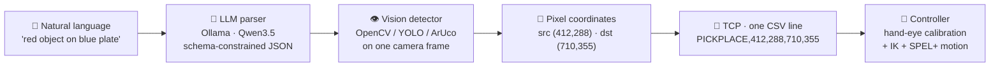
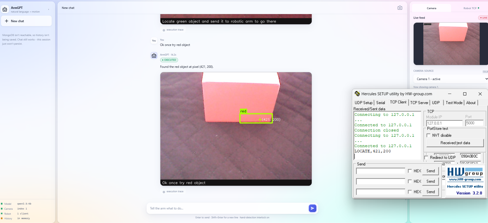

<div align="center">

# 🦾 ArmGPT

**Talk to a robot arm. It looks, finds, and picks.**

A natural-language command layer for a SCARA pick-and-place cell. Type
*"place the red object on the blue plate"* into a chat window - a **local** LLM
parses the intent, a computer-vision detector locates the objects in the camera
frame, and the pixel coordinates go to the robot controller over TCP.

Everything runs on your own machine. No paid APIs, no cloud.


</div>

---

## Table of contents

- [What it does](#what-it-does)
- [How it works](#how-it-works)
- [Features](#features)
- [Prerequisites](#prerequisites)
- [Install & run](#install--run)
- [Using it](#using-it)
- [The TCP link](#the-tcp-link)
- [Detectors](#detectors)
- [When it refuses](#when-it-refuses)
- [Configuration](#configuration)
- [Cameras](#cameras)
- [Performance reality](#performance-reality)
- [Troubleshooting](#troubleshooting)
- [Project structure](#project-structure)
- [Roadmap & known gaps](#roadmap--known-gaps)
- [DEMO Image](#demo-image)
- [Contributing](#contributing)
- [Acknowledgements](#acknowledgements)
- [License](#license)

---

## What it does

The robot cell already knows how to move - it has camera calibration and inverse
kinematics. What it *couldn't* do was take an instruction in plain English.
ArmGPT is that missing layer:

> **You:** place the red object on the blue plate
>
> **ArmGPT:** Picking up the red object and placing it on the blue plate.
> Pick (412, 288) → place (710, 355). Sent `PICKPLACE,412,288,710,355`.

Calibration and inverse kinematics live **on the controller**. ArmGPT never
converts pixels to world coordinates - it sends pixel coordinates and stops
there. That keeps this layer small, portable, and safe to reason about.

## How it works



A single command flows through six stages:

1. **Parse** - the LLM turns free text into `{action, source, target}` with each
   slot naming a detector and a match value. Output is constrained to a JSON
   schema, so it *can't* emit malformed intent.
2. **Detect** - the chosen detector runs on one freshly-captured frame and
   returns bounding boxes + centroids.
3. **Resolve** - the router picks the right candidate (or refuses; see
   [When it refuses](#when-it-refuses)).
4. **Format** - centroids become one CSV line.
5. **Send** - over TCP to the controller (or to Hercules, for testing).
6. **Execute** - the controller does calibration, IK, and the SPEL+ motion.

## Features

- 🗣 **Chat interface** - a clean, glassmorphism web UI; ask in plain English.
- 🧠 **Local LLM parsing** - Ollama + Qwen3.5, schema-constrained so intent is
  always valid JSON. Nothing leaves your machine.
- 👁 **Six detectors** - color, COCO objects (YOLOv8n), shapes, ArUco/QR markers,
  motion, and human presence. The LLM picks the cheapest one that fits.
- 🔌 **TCP server *or* client** - ArmGPT can listen for the controller or dial
  out to it, switchable live in the UI.
- 📹 **Live camera panel** - with a runtime source picker and per-detector tuning
  sliders, so you can see exactly what the arm sees.
- 🛑 **Safety refusals** - stops before moving if it finds nothing, finds too
  many things, or sees a hand in frame.
- 💾 **Chat history** - persisted to MongoDB if present; degrades to an
  in-memory store if not, so the app is fully usable either way.
- 🔁 **Self-healing camera** - reconnects on its own when a webcam is unplugged
  or stolen by another app, and never drops the live feed to enumerate devices.
- 🧪 **Dry-run by default** - formats and logs every command without opening a
  socket until you explicitly go live.

## Prerequisites

| Requirement | Notes |
|---|---|
| **Python 3.10–3.12** | mediapipe has no 3.13 wheels yet; verified on 3.11 |
| **[Ollama](https://ollama.com)** | running locally (`ollama serve`) with a Qwen3.5 model pulled |
| **A webcam** | overhead view of the workspace |
| **MongoDB** *(optional)* | on `127.0.0.1:27017` for persistent chat history — without it, history lives in memory |
| **A robot** *(optional)* | dry run is the default; Hercules stands in for the controller |
| **OS** | developed and tested on Windows 11. Linux/macOS should work — only the camera backend selection is platform-specific, and it handles both — but they are untested; reports welcome |

Pull an LLM (a small one is strongly recommended - see
[Performance reality](#performance-reality)):

```bash
ollama pull qwen3.5:4b        # works, ~12–20 s/command on CPU
# ollama pull qwen3.5:0.8b    # much faster if it fits your GPU VRAM
```

## Install & run

```powershell
git clone https://github.com/saisasi2004/ArmGPT.git
cd ArmGPT

python -m venv .venv
.venv\Scripts\Activate.ps1          # PowerShell   (use .venv\Scripts\activate.bat for cmd)

pip install -r requirements.txt
python app.py                        # → http://127.0.0.1:5050
```

On Linux/macOS the middle step is `source .venv/bin/activate`; everything else
is identical.

Open **http://127.0.0.1:5050** and start typing.

> [!IMPORTANT]
> **Activate the venv before `python app.py`.** If your prompt doesn't show
> `(.venv)`, you're running the system Python, which has none of the
> dependencies — and the symptom is confusing rather than obvious: the app
> starts anyway and reports MongoDB (or mediapipe, or torch) as unavailable
> when it's installed a directory away. `python -c "import pymongo"` is the
> quick check. To skip activation entirely, call the interpreter by path:
> `.venv\Scripts\python.exe app.py`.

> Neither Ollama nor MongoDB being down will stop the app from starting - the
> sidebar shows what's live and what isn't. The first command after launch may
> be slow while the model loads into RAM (ArmGPT warms it up in the background
> to avoid this).

Nothing needs configuring to run locally. If you want to change something,
`.env.example` lists every setting with its default; see
[Configuration](#configuration).

`ultralytics` downloads the YOLOv8n weights (`yolov8n.pt`, ~6 MB) automatically
the first time the `objects` detector is used, so it isn't checked into the repo.

## Using it

Type any of these in the chat:

| You say | What happens |
|---|---|
| `place the red object on the blue plate` | pick & place by **color** |
| `pick up marker 3 and put it on the green block` | **ArUco** → color |
| `where is the cup?` | **locate** a COCO object, report its pixel |
| `how many circles do you see?` | **count** by shape |
| `is anyone there?` | **presence** (hands/faces) |

The right panel has two tabs:

- **Camera** - the live feed, a source picker (handy when Windows renumbers your
  cameras), a preview-overlay selector, and live tuning sliders per detector.
- **Robot TCP** - connection mode, address, the dry-run switch, a manual
  command box, and a live traffic log of everything sent.

## The TCP link

Two modes, switchable live in the **Robot TCP** tab (or via `ARMGPT_ROBOT_MODE`):

- **server** *(default)* - ArmGPT **listens**; the controller (or
  [Hercules](https://www.hw-group.com/software/hercules-setup-utility), for
  testing) connects in as a client, and each command is broadcast to every
  connected client.
- **client** - ArmGPT **dials out** to a controller that is itself a listening
  TCP server, one short connection per command.

**Testing with Hercules:** run ArmGPT in *server* mode, set Hercules to its
**TCP Client** tab, point it at ArmGPT's `host:port` (default `127.0.0.1:5000`),
and click **Connect**. The Robot tab shows it as a connected client; send a
command and watch the CSV line arrive in Hercules.

In server mode `host` is the bind interface: `127.0.0.1` accepts only local
clients (fine for Hercules on the same PC); use `0.0.0.0` to let another machine
on the LAN connect.

### Wire format

One newline-terminated CSV line per command:

```
PICKPLACE,<src_u>,<src_v>,<dst_u>,<dst_v>\n     pick at (u,v), place at (u,v)
LOCATE,<u>,<v>\n                                 read-only; not currently sent
```

To change the format, edit `format_pick_place()` in `services/robot.py` - it's
the only place the wire representation is defined.

## Detectors

The LLM picks one per slot from this catalog. Cheapest that can do the job wins.

| key | method | `match` values |
|---|---|---|
| `color` | HSV threshold + contour centroid | red, green, blue, yellow, orange, purple |
| `objects` | YOLOv8n (COCO) | any of the 80 COCO class names |
| `shapes` | `approxPolyDP` vertex count | triangle, square, rectangle, pentagon, hexagon, circle |
| `markers` | `cv2.aruco` + QR | marker id (`"3"`) or QR payload |
| `motion` | frame diff / Farnebäck flow | - |
| `presence` | MediaPipe hands + face | hand, face |

`color` is the default workhorse: milliseconds, deterministic, no GPU. The
parser is nudged to prefer it whenever a color word appears - and a safety net
in `services/llm.py` rewrites, say, `objects/plate` → `color/blue` for "blue
plate", because "plate" isn't a COCO class and YOLO could never find it.

`objects` is closed-vocabulary - "the cup" works, "the widget" does not. That
needs the open-vocabulary path (Grounding DINO + SAM) noted in the roadmap.

Every detector is standalone-testable without the web app:

```bash
python -m detectors.color_detector      # opens a plain OpenCV window
```

## When it refuses

Three outcomes stop a command **before the arm moves**, each surfaced as a
normal chat reply (with an annotated snapshot):

- **not_found** - the detector saw nothing matching.
- **ambiguous** - several objects matched. It asks which one rather than
  guessing; silently picking one is how the arm grabs the wrong thing.
- **blocked** - a hand is visible in frame.

> [!WARNING]
> The hand interlock is a **convenience check, not a safety-rated system**.
> MediaPipe misses hands, and a missed hand means the arm moves anyway. It
> fails open if mediapipe isn't installed. **It must never be the only thing
> between a person and the arm.** Disable with `ARMGPT_SAFETY_CHECK=0`.

## Configuration

Every setting is an environment variable - nothing needs editing to move between
your desk and the robot cell.

| env var | default | meaning |
|---|---|---|
| `ARMGPT_OLLAMA_HOST` | `http://localhost:11434` | Ollama endpoint |
| `ARMGPT_LLM_MODELS` | `qwen3.5:4b,qwen3.5:latest,qwen3:4b,qwen3:8b` | preference list; first tag actually pulled wins |
| `ARMGPT_LLM_KEEP_ALIVE` | `-1` | keep model in RAM (`-1` = forever, or `"30m"`) |
| `ARMGPT_LLM_WARMUP` | `1` | load the model at startup so command 1 isn't slow |
| `ARMGPT_LLM_THINK` | `0` | Qwen3 thinking mode; off - the arm blocks on this call |
| `ARMGPT_LLM_TIMEOUT` | `120` | per-request timeout, seconds |
| `ARMGPT_LLM_NUM_CTX` | `4096` | context window — also a RAM cap, see below |
| `ARMGPT_CAMERA_INDEX` | `0` | startup index only; switch live in the Camera tab |
| `ARMGPT_CAMERA_WIDTH` / `_HEIGHT` | `1280` / `720` | requested capture resolution |
| `ARMGPT_CV_VERBOSE` | `0` | `1` restores OpenCV's raw videoio logging |
| `ARMGPT_ROBOT_MODE` | `server` | `server` (ArmGPT listens) or `client` (dials out) |
| `ARMGPT_ROBOT_HOST` / `_PORT` | `127.0.0.1` / `5000` | server: bind interface · client: controller address |
| `ARMGPT_ROBOT_TIMEOUT` | `5` | client-mode connect timeout, seconds |
| `ARMGPT_ROBOT_DRY_RUN` | `1` | **format and log, never send** |
| `ARMGPT_SAFETY_CHECK` | `1` | hand-detection interlock |
| `ARMGPT_MONGO_URI` | `mongodb://127.0.0.1:27017` | chat-history store; optional |
| `ARMGPT_MONGO_DB` | `armgpt` | database name |
| `ARMGPT_MONGO_TIMEOUT_MS` | `1500` | how long to wait for mongod at startup |
| `ARMGPT_HOST` / `ARMGPT_PORT` | `127.0.0.1` / `5050` | web server bind |
| `ARMGPT_DEBUG` | `0` | Flask debug logging |

`ARMGPT_LLM_NUM_CTX` is worth a word. Qwen3.5 advertises a 262k context window,
and letting Ollama size a KV cache for that on a 16 GB box — while torch and
mediapipe are also resident — is a good way to get a bare `500` back from
`/api/chat` two minutes later. The intent prompt is ~900 tokens and the reply is
capped at 256, so 4096 is generous and bounded.

Robot settings and the chosen camera index are also editable in the UI and
**persist to MongoDB**, so they survive a restart (env vars still win). Without
Mongo they hold for the life of the process and then fall back to these
defaults.

`.env.example` in the repo root lists all of the above with inline notes. ArmGPT
reads plain environment variables and does not parse `.env` itself — export
them, or use a runner that loads the file for you.

## Cameras

Windows numbers cameras unpredictably - plugging in a USB webcam can make it
index 0 and demote the laptop's built-in cam to 1, or the reverse, and it can
change again on reboot. So the index in `config.py` is only a *starting guess*.

Use the **Camera tab → Camera source** dropdown to switch feeds live; the
picture updates in a second or two, and your choice is remembered. A source that
only streams black frames is flagged "no image - depth/IR?", which is how a
depth sensor (Orbbec, RealSense IR) shows up - not something you want as the
workspace cam.

**If the camera drops, ArmGPT reconnects itself.** Unplug the webcam, or let
Teams grab it, and the feed goes to `reconnecting…` while the capture thread
retries on a backoff that tops out at 15 s — plug it back in and the picture
returns without restarting the server. **retry** forces an attempt immediately.
While a camera is down, chat commands that need to look refuse rather than
answer from the last frame they saw; a stale view of the table is worse than
admitting it can't see.

**rescan** is deliberately a button and not a background poll. Testing a camera
index means opening it, and opening it means taking it — including the one
you're watching. Doing that from a web request while the capture thread was
mid-read is what used to kill the live feed on Windows with

```
OnReadSample() is called with error status: -1072873821
CvCapture_MSMF::grabFrame videoio(MSMF): can't grab frame
```

Now every `cv2.VideoCapture` call in the app happens on the capture thread: a
rescan is a *request* the capture loop services between frames, after releasing
the device cleanly. The feed pauses for ~3 s and comes back. Results are cached
for a minute, so opening the page costs nothing.

Camera probing is also quiet now. OpenCV writes a wall of `VIDEOIO(MSMF):
backend is generally available but can't be used to capture by index` and
`obsensor ... Camera index out of range` straight to stderr for every index that
*isn't* a camera — normal, unactionable, and indistinguishable from a crash in a
log. It's suppressed in `core/__init__.py`; set `ARMGPT_CV_VERBOSE=1` to get it
back when you're actually debugging capture.

## Performance reality

*Measured on the development machine - an MX550 with 2 GB VRAM.* Every candidate
model is bigger than that, so Ollama runs them ~97% on CPU:

| model | size | offload | warm latency |
|---|---|---|---|
| `qwen3.5:latest` (9.7B) | 6.3 GB | 98% CPU | 25–45 s |
| `qwen3.5:4b` | 3.8 GB | 97% CPU | 12–20 s |

`ollama ps` is the ground truth - check the `PROCESSOR` column. Anything on CPU
is why a command takes tens of seconds; it is **not** the vision layer, which
resolves colors in milliseconds.

**If you have GPU VRAM to spare, use a model that fits it.** A ~1B model
(`qwen3.5:0.8b`, ~1 GB) fully offloads and drops latency to ~1–3 s. Parsing is
narrow extraction, not deep reasoning, so a small model is usually plenty.

Things already done to keep the CPU free for the LLM:

- the model is pinned in RAM (`keep_alive`) and warmed at startup, so no idle
  reload penalty;
- the intent prompt and output schema are trimmed to the minimum tokens;
- the preview stream is capped at 15 fps and shared across viewers, so open tabs
  don't each spin up their own detector + JPEG encoder.

## Troubleshooting

The server console is the first place to look — camera, Ollama and Mongo
problems all surface there with a sentence explaining what to do.

### `MongoDB unavailable (No module named 'pymongo')`

You're running a Python that isn't the venv's. Activate it, or run
`.venv\Scripts\python.exe app.py`. This one is worth double-checking before
anything else: it also explains a missing `torch`, `mediapipe`, or `cv2`.

### `MongoDB unreachable at mongodb://127.0.0.1:27017`

`mongod` isn't running. Start it (`mongod --dbpath <your-data-dir>`, or
`net start MongoDB` if you installed it as a Windows service). **Mongo is
optional** — without it ArmGPT keeps history in memory and everything works
normally; you just lose the transcript when the server stops, and the sidebar
shows `History · in memory`.

If it *is* running and still unreachable, check the URI is `127.0.0.1` rather
than `localhost`: Windows resolves `localhost` to `::1` first, and mongod binds
IPv4 only by default.

### A command answers `error` after ~120 s, and the log shows `500` from Ollama

Not enough free RAM for the model. Ollama loads a separate copy per concurrent
request, so this used to happen when a command arrived while the startup warmup
was still loading — ArmGPT now serialises every generation, so the second caller
waits for the load the first one is already paying for, and retries once on a
5xx. If you still hit it: close what you can, lower `ARMGPT_LLM_NUM_CTX`, set
`ARMGPT_LLM_KEEP_ALIVE=30m` to release the model when idle, or move to a smaller
tag with `ARMGPT_LLM_MODELS`. `ollama ps` shows what's resident.

### The first command after launch is very slow

Expected — the model is loading from disk (~40 s for a 4B on this hardware).
ArmGPT warms it up in the background at startup so this normally lands before
you've finished typing; `ARMGPT_LLM_WARMUP=0` disables that. After the first
load, `keep_alive=-1` pins the model so it never pays again.

### Every command takes 15–45 s

Your model is running on the CPU. See
[Performance reality](#performance-reality) — this is the single biggest lever
on responsiveness, and it is not the vision layer, which resolves colors in
milliseconds.

### The video panel says "Connecting to camera…" forever

The log names the reason. Common ones: the camera is held by another app (Teams,
Zoom, the Windows Camera app — close it and press **retry**); Windows camera
privacy settings are blocking desktop apps (Settings → Privacy & security →
Camera); or the index is wrong — press **rescan** and pick another source.

### The feed is live but black

That's a depth/IR sensor, not a webcam. ArmGPT flags those as
`no image - depth/IR?` in the source list and refuses to prefer them; pick a
different index. A lens cap or laptop privacy shutter looks identical.

### `pyzbar` fails to import / QR codes don't decode

pyzbar needs the zbar shared library. It's bundled in the Windows wheel; on
Debian/Ubuntu `sudo apt install libzbar0`, on macOS `brew install zbar`. ArUco
markers work without it — only QR decoding is affected.

### Nothing reaches the robot

Check the **Robot TCP** tab. Dry run is on by default and formats every command
without opening a socket — the reply says `(dry run — no socket opened)` when
that's what happened. In server mode you also need a client actually connected;
"listening, no client yet" means the command went nowhere.

## Project structure

```
app.py                  Flask entry point + all routes
config.py               every setting, all env-overridable
.env.example            every setting with its default, annotated
core/
  __init__.py           quiets OpenCV's videoio logging before cv2 loads
  base_detector.py      Detection dataclass + BaseDetector ABC
  camera.py             threaded latest-frame buffer, auto-reconnect, source switch
  overlay_utils.py      shared box / centroid / label drawing
detectors/
  __init__.py           lazy registry + shared lock
  color_detector.py     HSV thresholding (the pick-and-place workhorse)
  object_detector.py    YOLOv8n / COCO
  shape_detector.py     contour approximation
  marker_detector.py    ArUco + QR
  motion_detector.py    frame diff / optical flow
  presence_detector.py  MediaPipe hands + face
services/
  llm.py                Ollama client, schema-constrained intent parsing
  router.py             intent → detector → pixels → robot, with refusals
  robot.py              TCP server/client, CSV formatting, traffic log
  store.py              chat history + settings; MongoDB or in-memory
templates/  static/     the chat UI (HTML / CSS / vanilla JS)
eval_intent.py          offline accuracy/latency benchmark for the parser
```

**Web routes:** `/api/chat`, `/api/sessions/*`, `/api/detectors`,
`/api/preview[/param]`, `/api/camera/{devices,switch,retry}`, `/video_feed`,
`/api/robot/{config,test,send,history}`, `/api/status`.

## Roadmap & known gaps

- **No verification loop.** The plan calls for re-detecting after a place to
  confirm success. Right now the command is fire-and-forget: the CSV goes out
  and nothing checks the result.
- **No open-vocabulary detection.** Object descriptions outside COCO classes,
  the six colors, and the six shapes can't be resolved yet. The intended path is
  Grounded-SAM 2 (Grounding DINO + SAM) as a local microservice.
- **Ambiguity resolution is manual.** It asks you to narrow down, but you can't
  yet answer "the left one" - spatial reasoning over candidates isn't wired up.
- **`motion` from chat is weak.** It's differential and needs two frames; the
  router primes it, but it's really a live-preview mode.
- **The UI loads Boxicons from a CDN.** Fine online; if the robot cell is
  air-gapped, vendor the icon library locally so glyphs still render.
- **No automated tests.** `eval_intent.py` covers the parser and detectors can
  be run standalone, but there is no suite. Contributions welcome.

## DEMO Image

Here is the DEMO Picture of ArmGPT.



## Contributing

Issues and pull requests are welcome — see **[CONTRIBUTING.md](CONTRIBUTING.md)**
for setup, house style, and what to run before opening a PR. The short version:

- You don't need a robot. Dry run is the default, and
  [Hercules](https://www.hw-group.com/software/hercules-setup-utility) stands in
  for the controller.
- Run `python eval_intent.py` for anything touching the prompt or schema, and
  report the before/after numbers.
- Comments here explain *why*, not *what*. If you fix something subtle, leave
  the reason behind.
- Open an issue before a behaviour change; bug fixes and docs can go straight to
  a PR.

The roadmap items above are all genuinely up for grabs.

## Acknowledgements

ArmGPT is a thin layer over other people's hard work, all of it open source:

- **[Ollama](https://ollama.com)** and **[Qwen3.5](https://github.com/QwenLM)**
  — local inference and the model doing the parsing.
- **[OpenCV](https://opencv.org)** — capture, HSV thresholding, contours, ArUco.
- **[Ultralytics YOLOv8](https://github.com/ultralytics/ultralytics)** — COCO
  object detection *(AGPL-3.0; note its terms if you redistribute)*.
- **[MediaPipe](https://ai.google.dev/edge/mediapipe)** — hand and face landmarks
  behind the presence detector and the interlock.
- **[Flask](https://flask.palletsprojects.com)**,
  **[pyzbar](https://github.com/NaturalHistoryMuseum/pyzbar)**,
  **[PyMongo](https://pymongo.readthedocs.io)**, and
  **[Boxicons](https://boxicons.com)**.

## License

Released under the **MIT License** — see [LICENSE](LICENSE). Use it, fork it,
ship it.

> [!CAUTION]
> This software commands physical machinery, and it is provided with **no
> warranty of any kind**. The hand-detection interlock is a convenience check
> built on a general-purpose vision model — it misses hands, and it fails open
> when mediapipe isn't installed. Anyone putting this on a real cell is
> responsible for an independent, safety-rated protective system (light
> curtains, interlocked guarding, an E-stop) that does not depend on this
> software in any way.

Note that `ultralytics` (the `objects` detector) is **AGPL-3.0**, which is more
restrictive than MIT. It is an optional runtime dependency, loaded lazily and
only when a command needs COCO detection — but if you redistribute a build that
includes it, its terms apply to you.