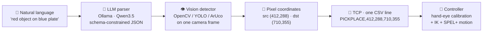

<div align="center">

# 🦾 ArmGPT

**Talk to a robot arm. It looks, finds, and picks.**

A natural-language command layer for a SCARA pick-and-place cell. Type
*"place the red object on the blue plate"* into a chat window — a **local** LLM
parses the intent, a computer-vision detector locates the objects in the camera
frame, and the pixel coordinates go to the robot controller over TCP.

Everything runs on your own machine. No paid APIs, no cloud.


</div>

---

## Table of contents

- [What it does](#what-it-does)
- [How it works](#how-it-works)
- [Features](#features)
- [Prerequisites](#prerequisites)
- [Install & run](#install--run)
- [Using it](#using-it)
- [The TCP link](#the-tcp-link)
- [Detectors](#detectors)
- [When it refuses](#when-it-refuses)
- [Configuration](#configuration)
- [Cameras](#cameras)
- [Performance reality](#performance-reality)
- [Project structure](#project-structure)
- [Roadmap & known gaps](#roadmap--known-gaps)
- [Acknowledgements](#acknowledgements)
- [License](#license)

---

## What it does

The robot cell already knows how to move — it has camera calibration and inverse
kinematics. What it *couldn't* do was take an instruction in plain English.
ArmGPT is that missing layer:

> **You:** place the red object on the blue plate
>
> **ArmGPT:** Picking up the red object and placing it on the blue plate.
> Pick (412, 288) → place (710, 355). Sent `PICKPLACE,412,288,710,355`.

Calibration and inverse kinematics live **on the controller**. ArmGPT never
converts pixels to world coordinates — it sends pixel coordinates and stops
there. That keeps this layer small, portable, and safe to reason about.

## How it works



A single command flows through six stages:

1. **Parse** — the LLM turns free text into `{action, source, target}` with each
   slot naming a detector and a match value. Output is constrained to a JSON
   schema, so it *can't* emit malformed intent.
2. **Detect** — the chosen detector runs on one freshly-captured frame and
   returns bounding boxes + centroids.
3. **Resolve** — the router picks the right candidate (or refuses; see
   [When it refuses](#when-it-refuses)).
4. **Format** — centroids become one CSV line.
5. **Send** — over TCP to the controller (or to Hercules, for testing).
6. **Execute** — the controller does calibration, IK, and the SPEL+ motion.

## Features

- 🗣 **Chat interface** — a clean, glassmorphism web UI; ask in plain English.
- 🧠 **Local LLM parsing** — Ollama + Qwen3.5, schema-constrained so intent is
  always valid JSON. Nothing leaves your machine.
- 👁 **Six detectors** — color, COCO objects (YOLOv8n), shapes, ArUco/QR markers,
  motion, and human presence. The LLM picks the cheapest one that fits.
- 🔌 **TCP server *or* client** — ArmGPT can listen for the controller or dial
  out to it, switchable live in the UI.
- 📹 **Live camera panel** — with a runtime source picker and per-detector tuning
  sliders, so you can see exactly what the arm sees.
- 🛑 **Safety refusals** — stops before moving if it finds nothing, finds too
  many things, or sees a hand in frame.
- 💾 **Chat history** — persisted to MongoDB if present; degrades gracefully to
  in-memory if not.
- 🧪 **Dry-run by default** — formats and logs every command without opening a
  socket until you explicitly go live.

## Prerequisites

| Requirement | Notes |
|---|---|
| **Python 3.10–3.12** | mediapipe has no 3.13 wheels yet; verified on 3.11 |
| **[Ollama](https://ollama.com)** | running locally (`ollama serve`) with a Qwen3.5 model pulled |
| **A webcam** | overhead view of the workspace |
| **MongoDB** *(optional)* | on `localhost:27017` for chat history |
| **Windows** | developed/tested on Windows 11; camera uses DirectShow/MSMF backends |

Pull an LLM (a small one is strongly recommended — see
[Performance reality](#performance-reality)):

```bash
ollama pull qwen3.5:4b        # works, ~12–20 s/command on CPU
# ollama pull qwen3.5:0.8b    # much faster if it fits your GPU VRAM
```

## Install & run

```powershell
git clone https://github.com/saisasi2004/ArmGPT.git
cd ArmGPT

python -m venv .venv
.venv\Scripts\Activate.ps1          # PowerShell   (use .venv\Scripts\activate.bat for cmd)

pip install -r requirements.txt
python app.py                        # → http://127.0.0.1:5050
```

Open **http://127.0.0.1:5050** and start typing.

> Neither Ollama nor MongoDB being down will stop the app from starting — the
> sidebar shows what's live and what isn't. The first command after launch may
> be slow while the model loads into RAM (ArmGPT warms it up in the background
> to avoid this).

`ultralytics` downloads the YOLOv8n weights (`yolov8n.pt`, ~6 MB) automatically
the first time the `objects` detector is used, so it isn't checked into the repo.

## Using it

Type any of these in the chat:

| You say | What happens |
|---|---|
| `place the red object on the blue plate` | pick & place by **color** |
| `pick up marker 3 and put it on the green block` | **ArUco** → color |
| `where is the cup?` | **locate** a COCO object, report its pixel |
| `how many circles do you see?` | **count** by shape |
| `is anyone there?` | **presence** (hands/faces) |

The right panel has two tabs:

- **Camera** — the live feed, a source picker (handy when Windows renumbers your
  cameras), a preview-overlay selector, and live tuning sliders per detector.
- **Robot TCP** — connection mode, address, the dry-run switch, a manual
  command box, and a live traffic log of everything sent.

## The TCP link

Two modes, switchable live in the **Robot TCP** tab (or via `ARMGPT_ROBOT_MODE`):

- **server** *(default)* — ArmGPT **listens**; the controller (or
  [Hercules](https://www.hw-group.com/software/hercules-setup-utility), for
  testing) connects in as a client, and each command is broadcast to every
  connected client.
- **client** — ArmGPT **dials out** to a controller that is itself a listening
  TCP server, one short connection per command.

**Testing with Hercules:** run ArmGPT in *server* mode, set Hercules to its
**TCP Client** tab, point it at ArmGPT's `host:port` (default `127.0.0.1:5000`),
and click **Connect**. The Robot tab shows it as a connected client; send a
command and watch the CSV line arrive in Hercules.

In server mode `host` is the bind interface: `127.0.0.1` accepts only local
clients (fine for Hercules on the same PC); use `0.0.0.0` to let another machine
on the LAN connect.

### Wire format

One newline-terminated CSV line per command:

```
PICKPLACE,<src_u>,<src_v>,<dst_u>,<dst_v>\n     pick at (u,v), place at (u,v)
LOCATE,<u>,<v>\n                                 read-only; not currently sent
```

To change the format, edit `format_pick_place()` in `services/robot.py` — it's
the only place the wire representation is defined.

## Detectors

The LLM picks one per slot from this catalog. Cheapest that can do the job wins.

| key | method | `match` values |
|---|---|---|
| `color` | HSV threshold + contour centroid | red, green, blue, yellow, orange, purple |
| `objects` | YOLOv8n (COCO) | any of the 80 COCO class names |
| `shapes` | `approxPolyDP` vertex count | triangle, square, rectangle, pentagon, hexagon, circle |
| `markers` | `cv2.aruco` + QR | marker id (`"3"`) or QR payload |
| `motion` | frame diff / Farnebäck flow | — |
| `presence` | MediaPipe hands + face | hand, face |

`color` is the default workhorse: milliseconds, deterministic, no GPU. The
parser is nudged to prefer it whenever a color word appears — and a safety net
in `services/llm.py` rewrites, say, `objects/plate` → `color/blue` for "blue
plate", because "plate" isn't a COCO class and YOLO could never find it.

`objects` is closed-vocabulary — "the cup" works, "the widget" does not. That
needs the open-vocabulary path (Grounding DINO + SAM) noted in the roadmap.

Every detector is standalone-testable without the web app:

```bash
python -m detectors.color_detector      # opens a plain OpenCV window
```

## When it refuses

Three outcomes stop a command **before the arm moves**, each surfaced as a
normal chat reply (with an annotated snapshot):

- **not_found** — the detector saw nothing matching.
- **ambiguous** — several objects matched. It asks which one rather than
  guessing; silently picking one is how the arm grabs the wrong thing.
- **blocked** — a hand is visible in frame.

> [!WARNING]
> The hand interlock is a **convenience check, not a safety-rated system**.
> MediaPipe misses hands, and a missed hand means the arm moves anyway. It
> fails open if mediapipe isn't installed. **It must never be the only thing
> between a person and the arm.** Disable with `ARMGPT_SAFETY_CHECK=0`.

## Configuration

Every setting is an environment variable — nothing needs editing to move between
your desk and the robot cell.

| env var | default | meaning |
|---|---|---|
| `ARMGPT_OLLAMA_HOST` | `http://localhost:11434` | Ollama endpoint |
| `ARMGPT_LLM_MODELS` | `qwen3.5:4b,qwen3.5:latest,qwen3:4b,qwen3:8b` | preference list; first tag actually pulled wins |
| `ARMGPT_LLM_KEEP_ALIVE` | `-1` | keep model in RAM (`-1` = forever, or `"30m"`) |
| `ARMGPT_LLM_WARMUP` | `1` | load the model at startup so command 1 isn't slow |
| `ARMGPT_LLM_THINK` | `0` | Qwen3 thinking mode; off — the arm blocks on this call |
| `ARMGPT_LLM_TIMEOUT` | `120` | per-request timeout, seconds |
| `ARMGPT_CAMERA_INDEX` | `1` | startup index only; switch live in the Camera tab |
| `ARMGPT_CAMERA_WIDTH` / `_HEIGHT` | `1280` / `720` | requested capture resolution |
| `ARMGPT_ROBOT_MODE` | `server` | `server` (ArmGPT listens) or `client` (dials out) |
| `ARMGPT_ROBOT_HOST` / `_PORT` | `127.0.0.1` / `5000` | server: bind interface · client: controller address |
| `ARMGPT_ROBOT_TIMEOUT` | `5` | client-mode connect timeout, seconds |
| `ARMGPT_ROBOT_DRY_RUN` | `1` | **format and log, never send** |
| `ARMGPT_SAFETY_CHECK` | `1` | hand-detection interlock |
| `ARMGPT_MONGO_URI` | `mongodb://localhost:27017` | chat-history store |
| `ARMGPT_MONGO_DB` | `armgpt` | database name |
| `ARMGPT_HOST` / `ARMGPT_PORT` | `127.0.0.1` / `5050` | web server bind |
| `ARMGPT_DEBUG` | `0` | Flask debug logging |

Robot settings and the chosen camera index are also editable in the UI and
**persist to MongoDB**, so they survive a restart (env vars still win).

## Cameras

Windows numbers cameras unpredictably — plugging in a USB webcam can make it
index 0 and demote the laptop's built-in cam to 1, or the reverse, and it can
change again on reboot. So the index in `config.py` is only a *starting guess*.

Use the **Camera tab → Camera source** dropdown to switch feeds live; the
picture updates in a second or two, and your choice is remembered. A source that
only streams black frames is flagged "no image — depth/IR?", which is how a
depth sensor (Orbbec, RealSense IR) shows up — not something you want as the
workspace cam.

## Performance reality

*Measured on the development machine — an MX550 with 2 GB VRAM.* Every candidate
model is bigger than that, so Ollama runs them ~97% on CPU:

| model | size | offload | warm latency |
|---|---|---|---|
| `qwen3.5:latest` (9.7B) | 6.3 GB | 98% CPU | 25–45 s |
| `qwen3.5:4b` | 3.8 GB | 97% CPU | 12–20 s |

`ollama ps` is the ground truth — check the `PROCESSOR` column. Anything on CPU
is why a command takes tens of seconds; it is **not** the vision layer, which
resolves colors in milliseconds.

**If you have GPU VRAM to spare, use a model that fits it.** A ~1B model
(`qwen3.5:0.8b`, ~1 GB) fully offloads and drops latency to ~1–3 s. Parsing is
narrow extraction, not deep reasoning, so a small model is usually plenty.

Things already done to keep the CPU free for the LLM:

- the model is pinned in RAM (`keep_alive`) and warmed at startup, so no idle
  reload penalty;
- the intent prompt and output schema are trimmed to the minimum tokens;
- the preview stream is capped at 15 fps and shared across viewers, so open tabs
  don't each spin up their own detector + JPEG encoder.

## Project structure

```
app.py                  Flask entry point + all routes
config.py               every setting, all env-overridable
core/
  base_detector.py      Detection dataclass + BaseDetector ABC
  camera.py             threaded latest-frame buffer + runtime source switch
  overlay_utils.py      shared box / centroid / label drawing
detectors/
  __init__.py           lazy registry + shared lock
  color_detector.py     HSV thresholding (the pick-and-place workhorse)
  object_detector.py    YOLOv8n / COCO
  shape_detector.py     contour approximation
  marker_detector.py    ArUco + QR
  motion_detector.py    frame diff / optical flow
  presence_detector.py  MediaPipe hands + face
services/
  llm.py                Ollama client, schema-constrained intent parsing
  router.py             intent → detector → pixels → robot, with refusals
  robot.py              TCP server/client, CSV formatting, traffic log
  store.py              MongoDB chat history + settings (degrades to no-op)
templates/  static/     the chat UI (HTML / CSS / vanilla JS)
eval_intent.py          offline accuracy/latency benchmark for the parser
```

**Web routes:** `/api/chat`, `/api/sessions/*`, `/api/detectors`,
`/api/preview[/param]`, `/api/camera/{devices,switch}`, `/video_feed`,
`/api/robot/{config,test,send,history}`, `/api/status`.

## Roadmap & known gaps

- **No verification loop.** The plan calls for re-detecting after a place to
  confirm success. Right now the command is fire-and-forget: the CSV goes out
  and nothing checks the result.
- **No open-vocabulary detection.** Object descriptions outside COCO classes,
  the six colors, and the six shapes can't be resolved yet. The intended path is
  Grounded-SAM 2 (Grounding DINO + SAM) as a local microservice.
- **Ambiguity resolution is manual.** It asks you to narrow down, but you can't
  yet answer "the left one" — spatial reasoning over candidates isn't wired up.
- **`motion` from chat is weak.** It's differential and needs two frames; the
  router primes it, but it's really a live-preview mode.
- **The UI loads Boxicons from a CDN.** Fine online; if the robot cell is
  air-gapped, vendor the icon library locally so glyphs still render.